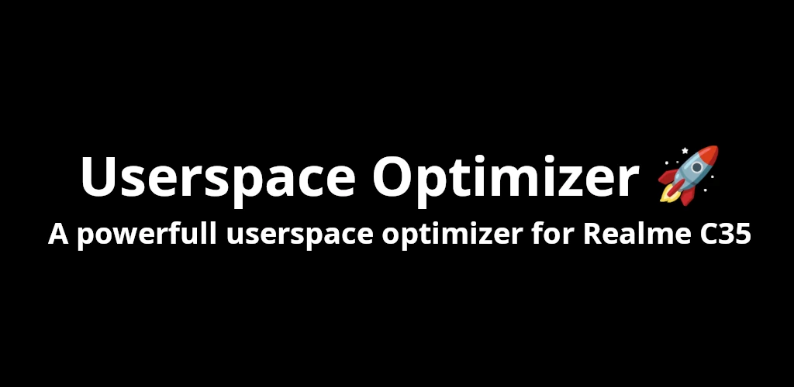

# Userspace Optimizer (Performance + Latency Priority) 🚀 Tweaked Only For Realme C35 (RMX3511)

A powerful userspace optimizer. 

## Working ⚙️

To understand the functioning of Userspace Optimizer, please examine the source code from the entrypoint located [here](src/userspace_optimizer.cpp).

## Credits 👥

- [Chirag](https://t.me/selfmuser) - Tester
- [Leaf](https://t.me/leafinferno) - Designer
- [Jis G Jacob](https://t.me/StudioKeys) - Tester
- [KTweak](https://github.com/tytydraco/KTweak) - BSD 2-Clause License
- [Uperf](https://github.com/yc9559/uperf) - Apache-2.0 License
- [Looper](https://github.com/iamlooper/Android-Enhancer) - Android-Optimizer
